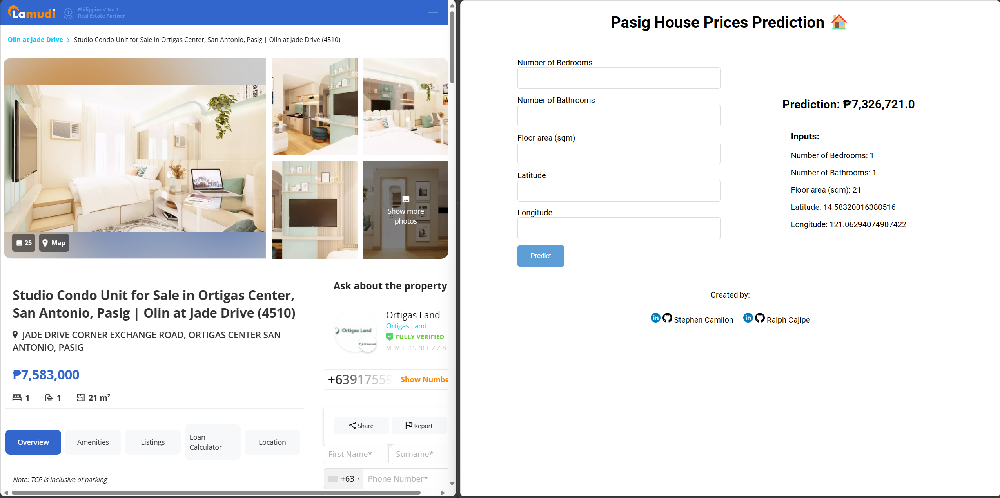
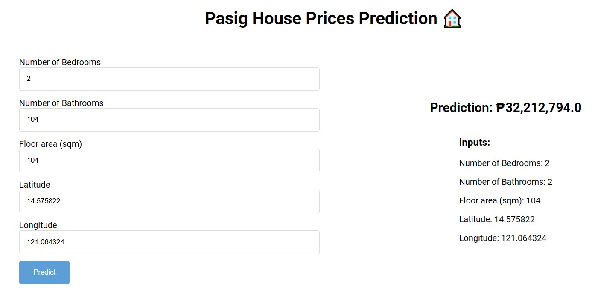
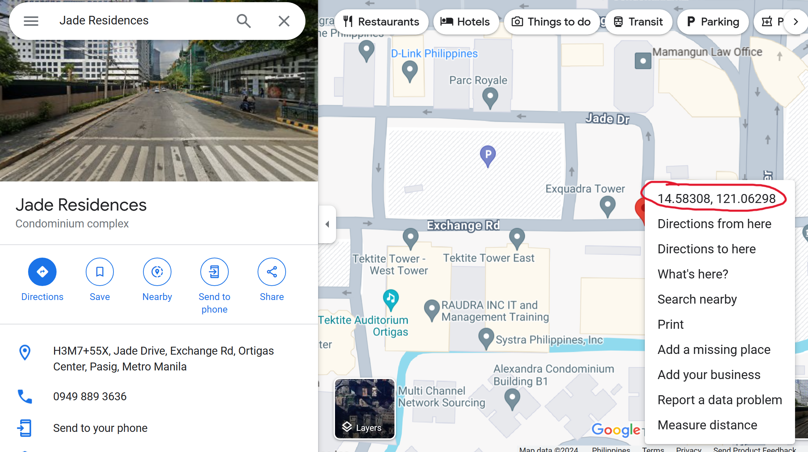
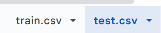
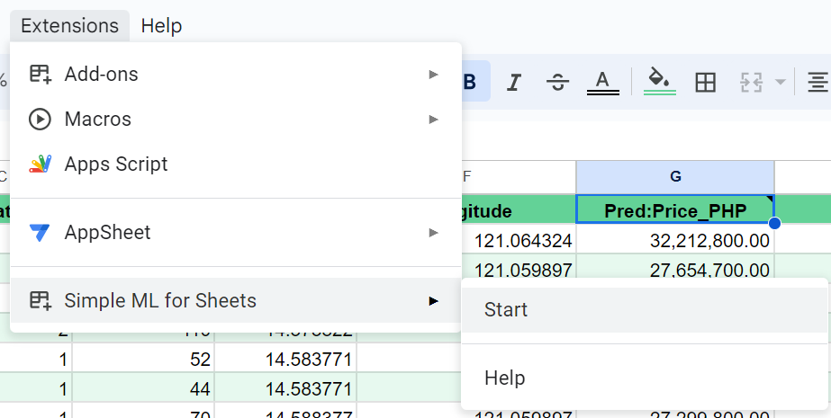
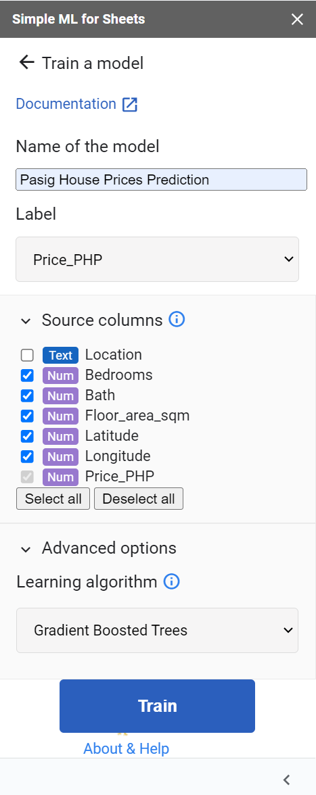
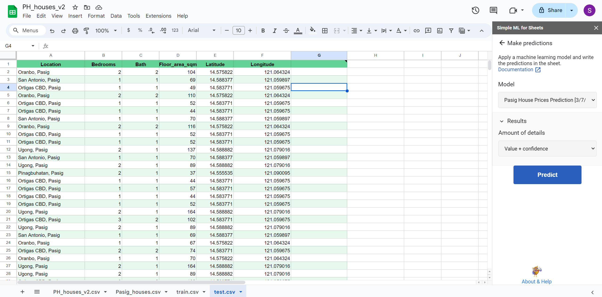
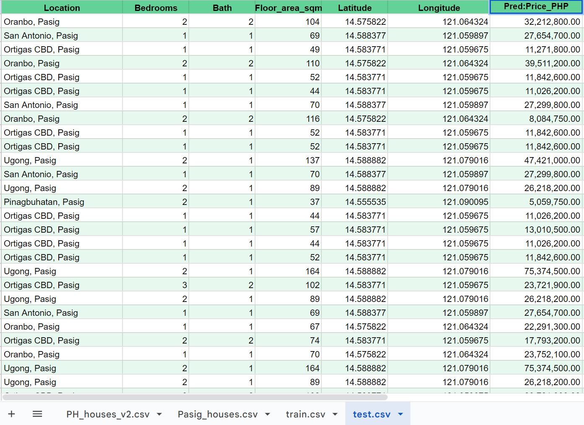

<!-- Add banner here -->

*Photo credit: [Yacine Petitprez](https://www.flickr.com/photos/anykeyh/15090916841/in/photostream/)*
# Pasig House Prices Prediction

<!-- Add buttons here -->


This project focuses on predicting house prices in Pasig City, Philippines. The data used for training is sourced from real estate listings in the Philippines (via [Kaggle](https://www.kaggle.com/datasets/arloblanco/philippine-real-estate)). The dataset is then used to train and build a model using two main approaches: TensorFlow Decision Forests and Simple ML for Sheets, with the Gradient Boosted Trees algorithm being a key component of our model. A web application was also developed so that users can input a property and receive an estimate of how much their preferred house will cost. This project is inspired by the California House Prices ([Kaggle](https://www.kaggle.com/datasets/camnugent/california-housing-prices)).

   <p align="center">
      
   </p> 

# Quickstart/Demo

### Simple ML Sheets in action with the Dataset
https://github.com/ralphcajipe/pasig-house-prices-prediction/assets/113228328/e6ec2c03-3dd7-4c10-bab3-e9a3264015b7

### Jupyter Notebook or Python Script
To use the model, you can load it with Google's [Yggdrasil Decision Forests (YDF)](https://github.com/google/yggdrasil-decision-forests) and make predictions with it. Yggdrasil Decision Forests powers TensorFlow Decision Forests. See the jupyter notebook located in the `notebooks` directory for the code implementation of training and testing using TensorFlow.  Here's an example of how to do this:
```bash

# Load the model with YDF
import ydf

model = ydf.from_tensorflow_decision_forests("../models/pasig-model")

# Make predictions with the model
examples = {
  "Bedrooms" : [2],
  "Bath" : [2],
  "Floor_area_sqm" : [104],
  "Latitude" : [14.575822],
  "Longitude" : [121.064324],
}
model.predict(examples)

# Output: array([32212794.], dtype=float32)
```


### Flask Web App
See `flask_app` directory for the code implementation on how to deploy the model as a web application.



# Table of Contents

- [Project Title](#project-title)
- [Quickstart/Demo](#quickstartdemo)
- [Table of Contents](#table-of-contents)
- [Installation](#installation)
- [Usage](#usage)
- [Contribute](#contribute)
- [License](#license)

# Installation
[(Back to top)](#table-of-contents)


To set up the project on your local machine, follow these steps:

1. Clone the repository: 

```shell 
git clone https://github.com/ralphcajipe/pasig-house-prices-prediction.git
```

2. Navigate to the project directory: 
```shell 
cd pasig-house-prices-prediction
```
3. Install the required dependencies: 
```shell
pip install -r requirements.txt
```

# Data Source 

The project uses the following data source:

- [Philippine Real Estate](https://www.kaggle.com/datasets/arloblanco/philippine-real-estate) (Last updated 2022, 2 years ago)

The data for this project comes from the `PH_houses_v2.csv` file, which contains information about house prices in the Philippines. The dataset includes the following columns:

- `Description`: A brief description of the house.
- `Location`: The city where the house is located.
- `Price (PHP)`: The price of the house in Philippine Pesos.
- `Bedrooms`: The number of bedrooms in the house.
- `Bath`: The number of bathrooms in the house.
- `Floor_area (sqm)`: The floor area of the house in square meters.
- `Land_area (sqm)`: The land area of the house in square meters.
- `Latitude`: The latitude coordinate of the house.
- `Longitude`: The longitude coordinate of the house.
- `Link`: A link to the online listing of the house.

## Data Extraction

The data for this project was extracted from a Kaggle dataset. Then it was placed in a `csv` file to split it between training and testing dataset (70%-30%)

## Data Cleaning

Before using the data to train our model, we performed extensive data cleaning. This included pandas for cleaning the dataset, removing any features that are not usable for training the model and only focusing the city of Pasig as there are other datas that are located outside Metro Manila and Pasig itself. 

## Model Training

We used the cleaned data to train our house price prediction model. The model was built using TensorFlow Decision Forests and Simple ML for Sheets, with the Gradient Boosted Trees algorithm being a key component. 

## Obtaining Latitude and Longitude for Pasig City

To compare real-time property price data from Lamudi in Pasig City with our project, you'll need the latitude and longitude of the specific location you're interested in. Here's how you can obtain these coordinates:

1. Identify the address of the property you're interested in.
2. Enter this address into Google Maps.
3. Right-click on the red pin that marks the location of the address.
4. The latitude and longitude of the location will be displayed. Note that the latitude is the first number (on the left), and the longitude is the second number (on the right).

You can then input these coordinates into our project to perform the comparison.

   <p align="center">
      
   </p> 

# Code Structure
[(Back to top)](#table-of-contents) 

The project is organized as follows:

```shell
.
├── data/           - Contains the raw data files.
├── models/         - Contains the trained models.
├── notebooks/      - Contains the Jupyter notebooks.
├── scripts/        - Contains the Python scripts.
├── requirements.txt - Lists the Python dependencies.
└── README.md       - The file that you are currently reading.
```

# Results and Evaluation
[(Back to top)](#table-of-contents)

The project achieves a Root Mean Squared Error (RMSE) of 1162.05 on the training set. The evaluation methodology used is RMSE because the label (Price_PHP) of the model is a numerical column, the model is trained to do regression, and the reported metrics will include such as RMSE. See the jupyter notebook located in the `notebooks` directory for the full details of the evaluation.

# Usage
[(Back to top)](#table-of-contents)

#### 1. Go to the Google Workspace Marketplace and search for [`Simple ML for Sheets`](https://workspace.google.com/marketplace/app/simple_ml_for_sheets/685936641092)

   a. After downloading, open the Google Sheet that contains your data (you can download the `train.csv` and `test.csv` respectively).

   <p align="center">
      
   </p> 

   b. Click on "Extensions" in the menu, then select "Simple ML for Sheets" > "Start".

   <p align="center">
      
   </p> 

   c. In the Simple ML for Sheets sidebar, select the range of cells that contains your data.

   d. Choose the column that you want to predict, then click "Train Model". Simple ML for Sheets will automatically choose a model based on your data. (Remember to tick off `Location` or remove the column `Location` as that is not needed for training the model. And you must be in the `train.csv` file.) The label is also ticked off as it is the one being trained to make predictions later on.

   <p align="center">
      
   </p> 
   
   e. After the model has been trained, switch to `test.csv`, to make predictions. (Also to remove Price_PHP in the `test.csv`, whenever making predictions, as it will cause data leakage if so.)

   <p align="center">
      
   </p> 

   f. The predictions are then added to your sheets (generally on the rightmost part of your dataset)
   
   <p align="center">
      
   </p> 

#### 2. Using the Flask web app. Run the Flask server (development) using the following command:
   ```bash
   python server.py
   ```
   If you want to run the server in production, you can use the following command:
   ```bash
   waitress-serve --host 127.0.0.1 server:app
   ```


# Contribute
[(Back to top)](#table-of-contents)

Pull requests are welcome. For major changes, please open an issue first to discuss what you would like to change.

# License
[(Back to top)](#table-of-contents)

[MIT license](./LICENSE)
